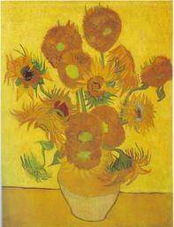

# Tutorial #3: Drawing on the Screen

OK, so now that we can respond to events, let's actually draw something!

Graphics in SDL are handled by interacting with a `Surface` object that represents a region of pixels. Every SDL `Window` has a `Surface` that represents the window and, when drawn on, shows up on the actual screen. Drawing on surfaces is optimized, so when you draw something, it doesn't immediately show up on the screen. Instead, all the changes that you want to make to the surface are batched up and then you call `UpdateSurface` to cause them all to become visible at once.

## Step 1: Get an image

First, we need to load an image that we're going to draw on the screen. Let's use this public domain image:



Save the image to the file `Sunflowers.bmp` and go back now to the program we created in the previous tutorial. Open the project file and add this:

```xml
  <ItemGroup>
    <Content Include="Sunflowers.bmp">
      <CopyToOutputDirectory>PreserveNewest</CopyToOutputDirectory>
    </Content>
  </ItemGroup>
```

This will cause the image to get copied to the output directory when the project builds.

## Step 2: Load the image

Now add this line right after the `Window.Create` statement:

```csharp
using var sunflowers = Surface.LoadBmp("Sunflowers.bmp");
```

This line will load the image file into a `Surface` that's not tied to any particular window.

## Step #3: Allow stretching the image

For the purposes of this tutorial, we're going to allow the user to view the image in one of two ways: they can either view it at its original size, or they can view it stretched to the entire window. So let's set up a way for the user to switch between these views. After the `LoadBmp` call add the following code:

```csharp
var stretch = false;

Keyboard.KeyDown += (s, e) =>
{
    switch (e.Keycode)
    {
        case Keycode.s:
            stretch = !stretch;
            break;
    }
};
```

The `strech` variable will indicate whether the image should be stretched to the entire window. We set up an event handler to toggle between the modes using the `s` key.

## Step #4: Drawing the image

Now, at long last, we're ready to draw the image! So add the following to the `DispatchEvents` loop:

```csharp
    if (stretch)
    {
        sunflowers.BlitScaled(window.Surface, null, (Point.Origin, windowSize));
    }
    else
    {
        sunflowers.Blit(window.Surface);
    }
```

This code does a [bit blit](https://en.wikipedia.org/wiki/Bit_blit) from the surface that contains the sunflower image to the window's surface. If the user hasn't asked for the image to be stretched, we just do a normal bit blit. Otherwise, we do a "scaled" bit blit which will stretch the image to a particular size. In this case, we specify that we want the image stretched to the entire window area.

If we ran the code at this point, we would just see a blank screen. That's because we need to tell the window to update its surface with the changes we made. So add this after the bit blt code above:

```csharp
window.UpdateSurface();
```

Now `dotnet run` will bring up a window that lets you view the image in two sizes! (Note that if you switch from stretch mode to regular, the area of the window that isn't covered by the smaller image will still show the stretched image. That's because we don't clear the window between draws, something we'll touch on later.)