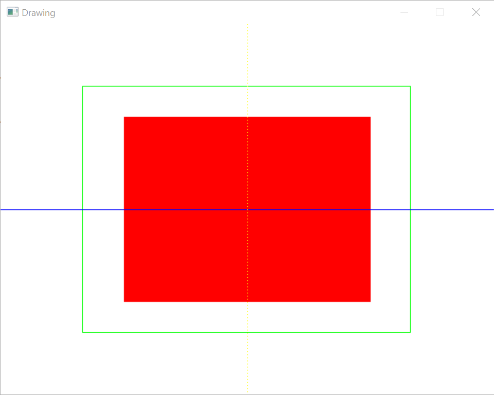
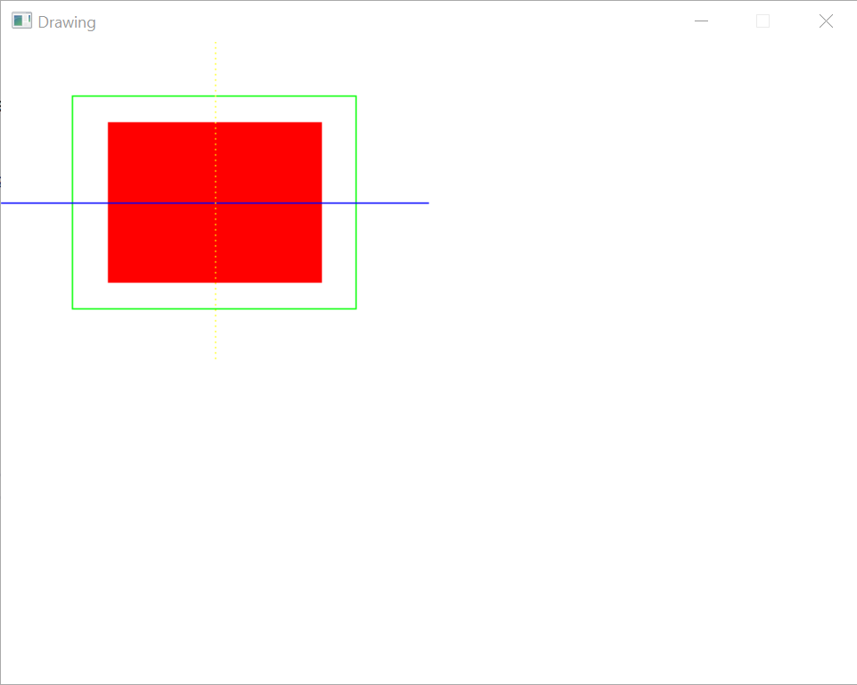

# Tutorial #6: Drawing

All of the tutorials so far have been centered on drawing pre-made images on the screen, but it's important to note that it's not the only kind of drawing that you can do with SDL. This tutorial covers some of the other operations that you can do.

# Step #1: Drawing and filling rectangles

Let's go back to the previous tutorial and remove all the image drawing: delete the `sunflowers` local variable, the `KeyDown` handler, and the `Copy` call in the event loop. Now let's do two drawing operations instead. After the call to `Clear` add:

```csharp
var size = windowSize;

renderer.DrawColor = Colors.Red;
renderer.FillRectangle(((size.Width / 4, size.Height / 4), (size.Width / 2, size.Height / 2)));
```

This will set the drawing color to red and then fill a rectange with red on the screen. You can also just draw the outline of a rectangle:

```csharp
renderer.DrawColor = Colors.Green;
renderer.DrawRectangle(((size.Width / 6, size.Height / 6), (size.Width * 2 / 3, size.Height * 2 / 3)));
```

# Step #2: Drawing lines

Instead of drawing a whole rectangle, you can also just draw a line:

```csharp
renderer.DrawColor = Colors.Blue;
renderer.DrawLine((0, size.Height / 2), (size.Width, size.Height / 2));
```

# Step #3: Drawing points

Or you can just draw points:

```csharp
renderer.DrawColor = Colors.Yellow;
for (var i = 0; i < size.Height; i += 4)
{
    renderer.DrawPoint((size.Width / 2, i));
}
```

If you do a `dotnet run` after adding all of these drawing commands, you should see:



# Step #4: Restrict the drawing area

If you only want to draw on a specific portion of the screen, you can restrict the _viewport_ of the renderer to just the area of the overall surface that you want to draw on. This can be particularly useful if you want to execute the same draw operations on different portions of the surface.

Right after the `Renderer.Create` call, add the following code:

```csharp
Rectangle? viewport = null;

Keyboard.KeyDown += (s, e) =>
{
    switch (e.Keycode)
    {
        case Keycode.Number0:
            viewport = null;
            break;

        case Keycode.Number1:
            viewport = (Point.Origin, (windowSize.Width / 2, windowSize.Height / 2));
            break;

        case Keycode.Number2:
            viewport = ((windowSize.Width / 2, 0), (windowSize.Width / 2, windowSize.Height / 2));
            break;

        case Keycode.Number3:
            viewport = ((0, windowSize.Height / 2), (windowSize.Width, windowSize.Height / 2));
            break;
    }
};
```

This defines a new `Rectangle` that defines the area of the surface that we are working on at the time. Then it sets up key handlers to choose different areas:

0. Whole screen
1. Top left corner
2. Top right corner
3. Bottom half

Now change the `var size` line to:

```csharp
renderer.Viewport = viewport;
var size = viewport?.Size ?? windowSize;
```

And add before the `Present` call:

```csharp
renderer.Viewport = null;
```

This sets the viewport before we draw and then resets it after we are done. Now `dotnet run` and hitting the `1` key will show:



