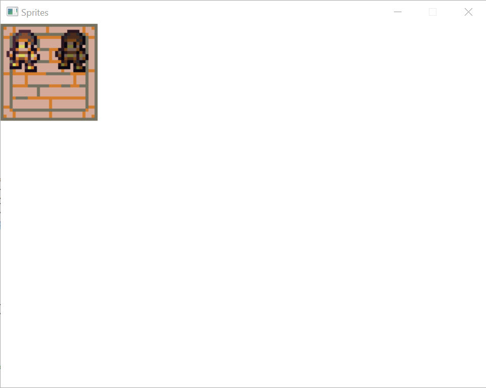
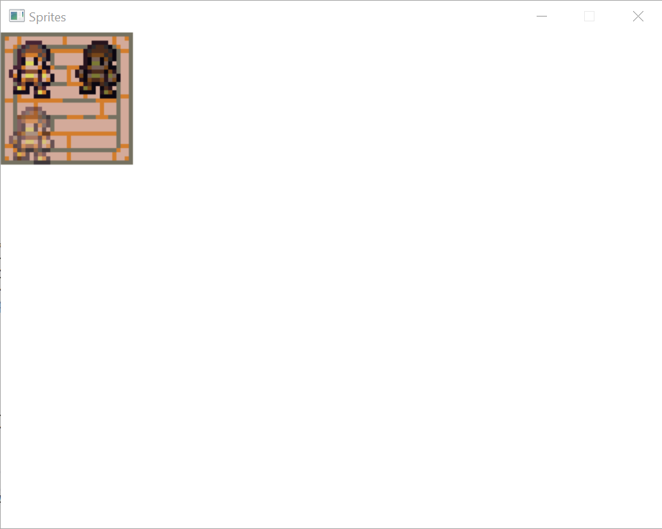

# Tutorial #7: Sprites

In previous tutorials, we loaded an image into a texture and then copied that image to the window. A common method of 2D drawing is to use _sprites_ which are pre-drawn images that are just copied to the screen, rather than drawn at run-time. For example, here are some _sprite sheets_ which contains a number of images useful for drawing a simple game:


We can then copy portions of the sprite sheet to create an image faster than drawing each image using a set of drawing commands.

(Note: All sample images in this tutorial come from the [DawnLike - 16x16 Universal Rogue-like tileset v1.81](https://opengameart.org/content/dawnlike-16x16-universal-rogue-like-tileset-v181) license [CC-BY 4.0](https://creativecommons.org/licenses/by/4.0/), credit to DragonDePlatino and DawnBringer.)

## Step #1: Load the sprites

Save the above sprite sheets into your project directory and call them `Floor.png`, `Player0.png` and `Player1.png`. Then modify your project file to include them:

```xml
  <ItemGroup>
    <Content Include="Floor.png">
      <CopyToOutputDirectory>PreserveNewest</CopyToOutputDirectory>
    </Content>
    <Content Include="Player0.png">
      <CopyToOutputDirectory>PreserveNewest</CopyToOutputDirectory>
    </Content>
    <Content Include="Player1.png">
      <CopyToOutputDirectory>PreserveNewest</CopyToOutputDirectory>
    </Content>
  </ItemGroup>
```

Now load the images right after `Renderer.Create`:

```csharp
using var floor = Image.Load("Floor.png", renderer);
using var player0 = Image.Load("Player0.png", renderer);
using var player1 = Image.Load("Player1.png", renderer);
```

## Step #2: Copy the sprites

Now we need to copy the sprites when rendering the window. We'll start by drawing a simple room with an upper left, upper right, lower left, and lower right corner:


To do this, we'll copy one region of the floor sprite sheet onto a region of the window. Each sprite on the sprite sheet is 16x16 pixels, so after loading the images, we'll create variable that represents that:

```csharp
Size spriteSize = (16, 16);
```

And then specify which sprites we want by using `Point` objects that refer to the coordinate in sprites that we want. (So the point `(2, 3)` would refer to the sprite that started at pixel `(32, 54)`.)

```csharp
Point upperLeftFloor = (7, 15);
Point upperRightFloor = (9, 15);
Point lowerLeftFloor = (7, 17);
Point lowerRightFloor = (9, 17);
```

Now, after the call to `renderer.Clear` in our drawing loop, we do the actual drawing:

```csharp
renderer.Copy(floor, (upperLeftFloor * 16, spriteSize), (Point.Origin, spriteSize * 4));
renderer.Copy(floor, (upperRightFloor * 16, spriteSize), ((spriteSize.Width * 4, 0), spriteSize * 4));
renderer.Copy(floor, (lowerLeftFloor * 16, spriteSize), ((0, spriteSize.Height * 4), spriteSize * 4));
renderer.Copy(floor, (lowerRightFloor * 16, spriteSize), ((spriteSize.Width * 4, spriteSize.Height * 4), spriteSize * 4));
```

Here we're copying each sprite from the sprite sheet to the window. We're also scaling up the sprite since 16x16 is going to be pretty small and hard to see, which is why we multiply the size of the target area we're copying to by 4.

## Step #3: Transparent sprites

Now let's draw a player sprite in the room. After copying the floor sprites in the main loop, we now draw the player:

```csharp
renderer.Copy(player0, (Point.Origin, spriteSize), (Point.Origin, spriteSize * 4));
```

Because the PNG image format supports image _transparency_, drawing the player on top of the floor tile will allow the floor to be seen through the transparent part of the player image:


(If you end up working with other image formats that indicate transparency using a specific color, you can specify that color as a parameter to the `Image.Load` call.)

## Step #4: Sprite animation

You'll notice that there are two player sprite sheets. Both sheets contain the same character in each position in the sheet, but moved slightly between the two of them. If we draw the sprite from one sheet and then the other, then the character image will appear to bob up and down. To do this, we change the character drawing code to pick one sheet and then the other.

We can't just flip from one image to the other on each iteration of the loop, as the loop will likely be running so fast that the character will bob too fast. So we'll use the system timer to change the animation frame every half second. So, first, we add before the main loop variables to help track what frame we're on and the last time we flipped frames:

```csharp
var last = Timer.Ticks;
var current = 0;
```

Next, at the begining of the loop, we check to see if it's time to flip the frame:

```csharp
if (Timer.Ticks - last > 500)
{
    last = Timer.Ticks;
    current = (current + 1) % 2;
}
```

Now we change the player drawing command to choose the right frame:

```csharp
var currentPlayer = current == 0 ? player0 : player1;
renderer.Copy(currentPlayer, (Point.Origin, spriteSize), (Point.Origin, spriteSize * 4));
```

Now running the application should show the character bobbing up and down!

## Step #5: Color modification

Now let's say that we wanted to draw another player, but use a different color for the player to distinguish it from the first player. We could manually edit the sprite sheet to create a different color sprite, but another way of approaching the problem is instead to use _color modification_. We can simply tell the renderer to modify all of the colors by a certain amount to produce a different colored sprite. So after drawing the first player, we can draw another next to it:

```csharp
currentPlayer.ColorMod = (0x8F, 0x8F, 0x8F);
renderer.Copy(currentPlayer, (Point.Origin, spriteSize), ((spriteSize.Width * 4, 0), spriteSize * 4));
currentPlayer.ColorMod = (0xFF, 0xFF, 0xFF);
```

Setting the `ColorMod` property indicates how much each color will be modified (and we reset it after drawing). Now we'll see:



## Step #6: Alpha blending

Another trick that we might want to perform is to make the player sprite itself transparent. This is different than what we did in step #3, because in that step only parts that _weren't_ part of the player were transparent. In this case, we'd like allow some of the background to show through the player itself, making a kind of "ghost" effect. We can do this through _alpha blending_. Each sprite has an alpha value which indicates how transparent the sprite is, from completely transparent (`0x00`) to no transparency (`0xFF`). If we change this value, we can make the background to blend through the sprite. So add another character draw:

```csharp
currentPlayer.AlphaMod = 0x8F;
renderer.Copy(currentPlayer, (Point.Origin, spriteSize), ((0, spriteSize.Height * 4), spriteSize * 4));
currentPlayer.AlphaMod = 0xFF;
```

This draws a character like this:



## Step #7: Rotation

The final sprite trick that we can use is _rotation_. When we copy a sprite, we can add a paramater to `Copy` to rotate the sprite some number of degrees. (We can also _flip_ the sprite as well, but we won't cover that since it's so similar to rotation). To see an example, we'll add a character who constantly turns. Below the `current` variable, define another variable which will the rotation for a fourth character:

```csharp
var rotation = 0;
```

Now when we update the `current` variable, we will also update the `rotation` variable 90 degrees each half-second:

```csharp
rotation = (rotation + 90) % 360;
```

And now we draw the rotated character:

```csharp
renderer.Copy(currentPlayer, (Point.Origin, spriteSize), ((spriteSize.Width * 4, spriteSize.Height * 4), spriteSize * 4), rotation, null, RendererFlip.None);
```

This will produce a character who constantly turns.