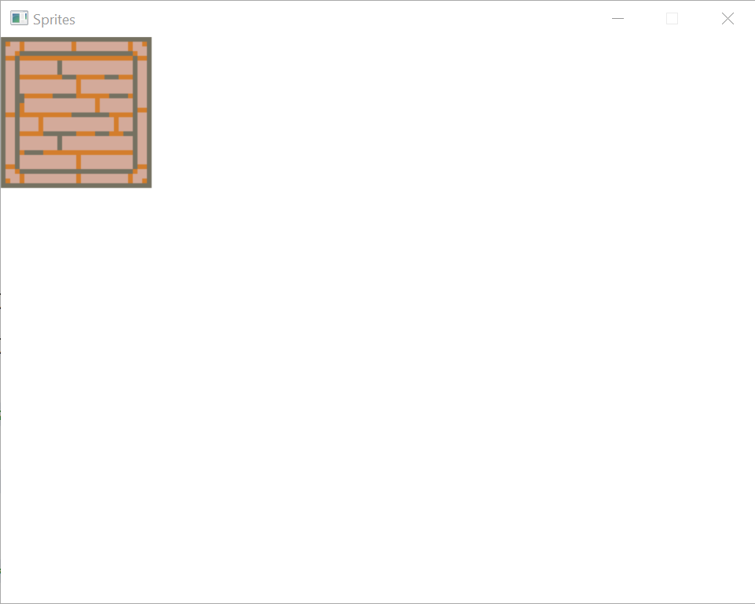
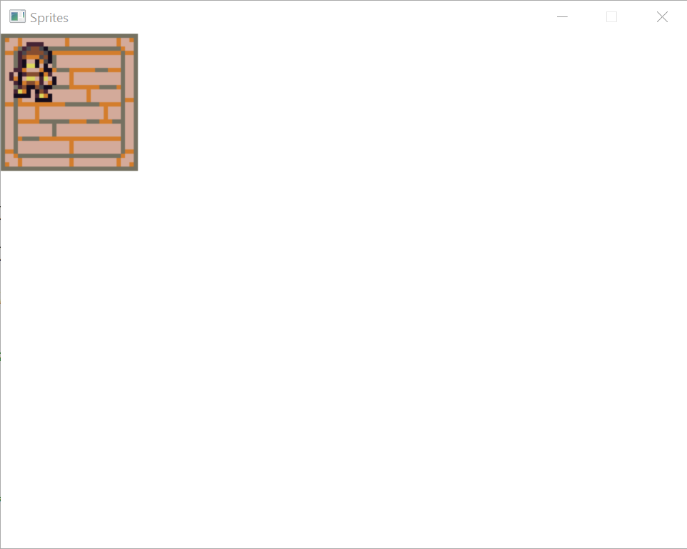

# Tutorial #7: Sprites

In previous tutorials, we loaded an image into a texture and then copied that image to the window. A common method of 2D drawing is to use _sprites_ which are pre-drawn images that are just copied to the screen, rather than drawn at run-time. For example, here is a _sprite sheet_ which contains a number of images useful for drawing floors all composed into a single image:


We can then copy portions of the sprite sheet to create an image faster than drawing each image using a set of drawing commands.

(Note: All sample images in this tutorial come from the [DawnLike - 16x16 Universal Rogue-like tileset v1.81](https://opengameart.org/content/dawnlike-16x16-universal-rogue-like-tileset-v181) license [CC-BY 4.0](https://creativecommons.org/licenses/by/4.0/), credit to DragonDePlatino and DawnBringer)

## Step #1: Load the sprite sheet

Save the above sprite sheet into your project directory and call it `Floor.png`. Then modify your project file to include the file:

```xml
  <ItemGroup>
    <Content Include="Floor.png">
      <CopyToOutputDirectory>PreserveNewest</CopyToOutputDirectory>
    </Content>
  </ItemGroup>
```

Now load the image right after `Renderer.Create`:

```csharp
using var floor = Image.Load("Floor.png", renderer);
```

## Step #2: Copy the sprites

Now we need to copy the sprites when rendering the window. We'll start by drawing a simple room with an upper left, upper right, lower left, and lower right corner:



To do this, we'll copy one region of the sprite sheet onto a region of the window. Each sprite on the sprite sheet is 16x16 pixels, so after loading the image, we'll create variable that represents that:

```csharp
Size spriteSize = (16, 16);
```

And then specify which sprites we want by using `Point` objects that refer to the coordinate in sprites that we want. (So the point `(2, 3)` would refer to the sprite that started at pixel `(32, 54)`.)

```csharp
Point upperLeftFloor = (7, 15);
Point upperRightFloor = (9, 15);
Point lowerLeftFloor = (7, 17);
Point lowerRightFloor = (9, 17);
```

Now, after the call to `renderer.Clear` in our drawing loop, we do the actual drawing:

```csharp
renderer.Copy(floor, ((upperLeftFloor.X * 16, upperLeftFloor.Y * 16), spriteSize), (Point.Origin, spriteSize * 4));
renderer.Copy(floor, ((upperRightFloor.X * 16, upperRightFloor.Y * 16), spriteSize), ((spriteSize.Width * 4, 0), spriteSize * 4));
renderer.Copy(floor, ((lowerLeftFloor.X * 16, lowerLeftFloor.Y * 16), spriteSize), ((0, spriteSize.Height * 4), spriteSize * 4));
renderer.Copy(floor, ((lowerRightFloor.X * 16, lowerRightFloor.Y * 16), spriteSize), ((spriteSize.Width * 4, spriteSize.Height * 4), spriteSize * 4));
```

Here we're copying each sprite from the sprite sheet to the window. We're also scaling up the sprite since 16x16 is going to be pretty small and hard to see, which is why we multiply the size of the target area we're copying to by 4.

## Step #3: Transparent sprites

Now we'd like to draw a player sprite in the room. First, let's load the sprite sheet that contains the player image after the call to load `Floor.png`:

```csharp
using var player0 = Image.Load("Player0.png", renderer);
```

Now after copying the floor sprites in the main loop, let's draw the player:

```csharp
renderer.Copy(player0, (Point.Origin, spriteSize), (Point.Origin, spriteSize * 4));
```

Because the PNG image format supports image transparency, drawing the player on top of the floor tile will allow the floor to be seen through the transparent part of the player image:



(If you end up working with other image formats that indicate transparency using a specific color, you can specify that color as a parameter to the `Image.Load` call.)

## Step #4: Sprite animation

